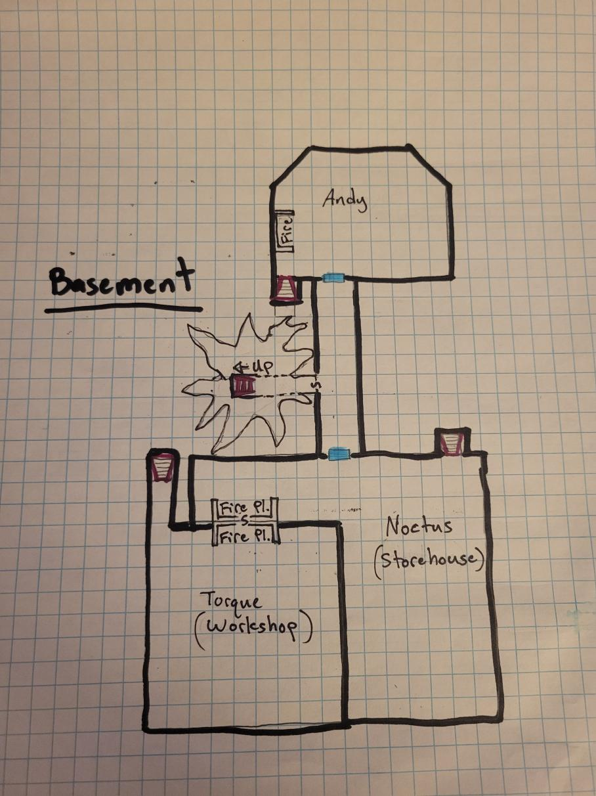

| Character                        | Specialty    | Abilities                                                                                                                                                                   | Tracking Notes               |
|----------------------------------|--------------|-----------------------------------------------------------------------------------------------------------------------------------------------------------------------------|------------------------------|
| [Shadowpaw](/players/shadowpaw/) | [Barracks](https://www.dndbeyond.com/sources/dnd/dmg-2024/bastions#Barrack)   | - Every 7 Days: Hire 4 defenders up to 12                                                                                                         | Bastion Defender Count: 0    |
| [Ariel](/players/ariel/)         | Garden       | - Short Rest: Heroic Inspiration  - Every 7 Days: Generate 1 vial of poison OR 2 vials of antitoxin   - 21 Days: Change garden type from Poison to Healing, Ornamental, or Food | Generation: 1 vial of poison |
| [Avö](/players/avo/)             | Library      | - Short Rest: Heroic Inspiration  - Every 7 Days: Get lore from the DM on a very specific topic                                                                          | Studying: (unknown)          |
| [Noctus](/players/noctus/)       | Storehouse   | - Every 7 Days: Buy up to 500gp of goods OR sell store for +10%                                                                                                             | Stored Value: 0gp            |
| [Andujar](/players/andujar/)     | Sanctuary    | - Long Rest: Gains ability to cast healing word for free once in the next 7 days   - Every 7 Days: Generate a Holy Symbol                                                |
| [Torque](/players/torque/)       | Workshop     | - Short Rest: Heroic Inspiration   - Every 7 Days: Generate an adventuring item with 1 of 6 crafting tools (Sal needs to choose)                                         | Generating: (unknown)        |
| [Felix](/players/felix/)         | Arcane Study | - Long Rest: Gains ability to cast Identify for free once in the next 7 days        - Every 7 Days: Generate an Arcane Focus OR a blank book (10gp)                      | Creating:   (unknown)        |
                                                                                                      

